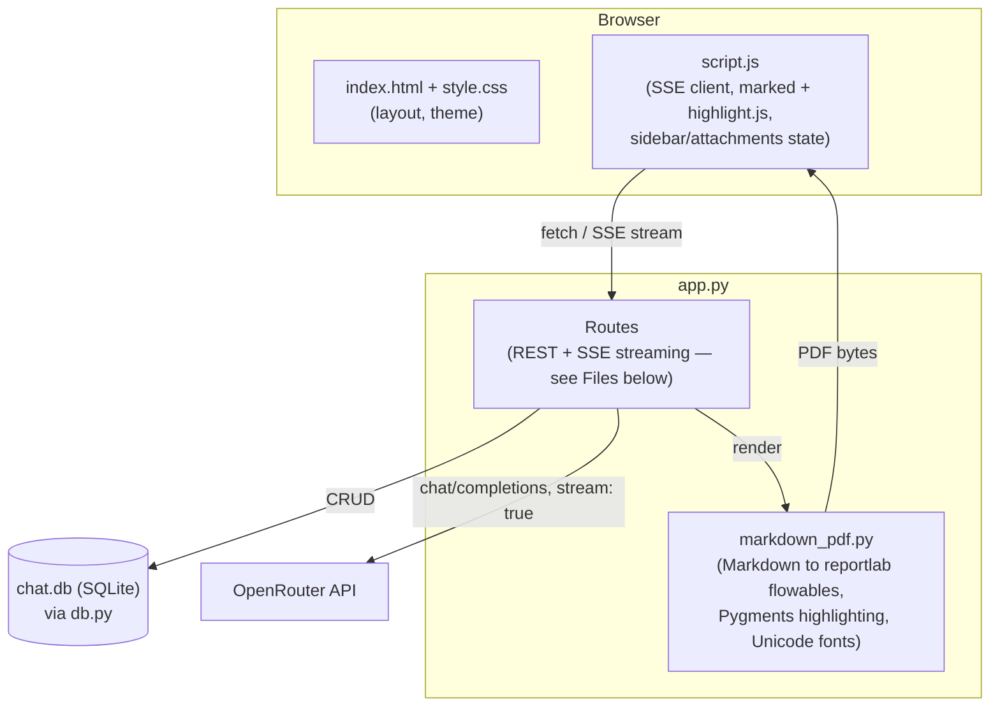
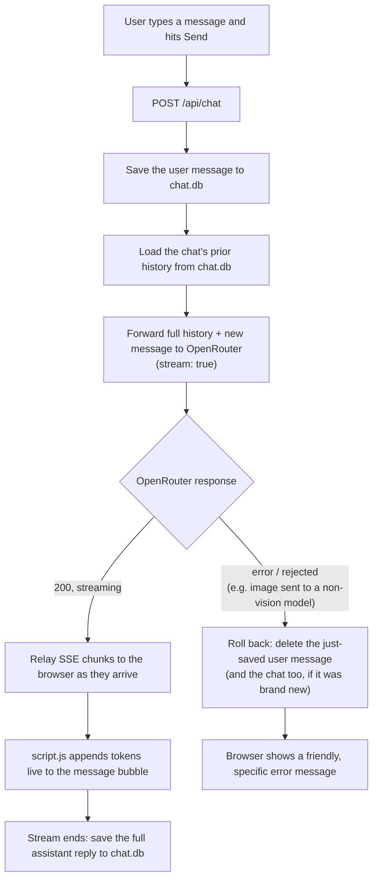

# Local OpenRouter Chat

A minimal local chat app (Flask backend + vanilla JS frontend) that sends prompts
to any model available on [OpenRouter](https://openrouter.ai) and streams the
response back in a ChatGPT/Claude-style UI.

## Setup

```bash
python -m venv venv
source venv/bin/activate
pip install -r requirements.txt

cp .env.example .env
# edit .env and set OPENROUTER_API_KEY to your key (https://openrouter.ai/keys)
```

## Run

```bash
python app.py
```

Then open http://localhost:5000

## Running tests

```bash
pip install -r requirements-dev.txt
pytest
```

Tests never touch the real `chat.db` — `db.DB_PATH` is redirected to an
isolated temp file per test (see `tests/conftest.py`), and all OpenRouter
network calls are mocked, so no API key or network access is needed to run
the suite.

## Type checking

`app.py`, `db.py`, and the test suite are fully type-annotated.

```bash
pip install -r requirements-dev.txt
mypy
```

## How it works

The app is a thin Flask backend that proxies chat completions to OpenRouter
and streams them to a vanilla-JS frontend over Server-Sent Events (SSE),
with SQLite for persistence.

### Architecture



### Sending a message



### Files

| File | Responsibility |
| --- | --- |
| `app.py` | Flask routes: streamed chat completions (`/api/chat`), model catalog (`/api/models`), file/PDF text extraction (`/api/extract`), chat list/get/delete/pin (`/api/chats...`), PDF export (`/api/chats/<id>/export`). |
| `db.py` | SQLite persistence layer (`chat.db`, created automatically) — `chats` and `messages` tables, auto-migrated schema, chat titles derived from the first message. |
| `markdown_pdf.py` | Renders an assistant reply's Markdown into `reportlab` PDF content: headings, lists, tables, blockquotes, and Pygments-syntax-highlighted code blocks. Uses bundled DejaVu Sans/Mono fonts (`fonts/`) instead of the PDF standard fonts, since those only cover Latin-1 and would show Greek, Cyrillic, APL symbols, etc. as blank boxes. Strips any `<think>...</think>` reasoning-model artifact (including a stray, unmatched closing tag) before rendering. |
| `static/script.js` | Reads the SSE stream chunk by chunk and renders tokens live; renders Markdown via `marked` with a `highlight.js` code-block renderer so code is syntax-highlighted the same way as in exported PDFs; manages the sidebar's chat list and attachment state. |
| `templates/index.html` + `static/style.css` | Sidebar with past chats (click to reopen, ✕ to delete, ⭐ to pin), model selector, "New chat", centered message list and composer — styled after Claude/ChatGPT, with a light/dark theme. |

## Notes

- Swap `DEFAULT_MODEL` in `.env` to any OpenRouter model id (e.g.
  `anthropic/claude-sonnet-4.5`, `openai/gpt-4o`, `google/gemini-2.0-flash-001`).
- This is boilerplate: no auth, no rate limiting. Add those before deploying
  anywhere beyond your own machine.
