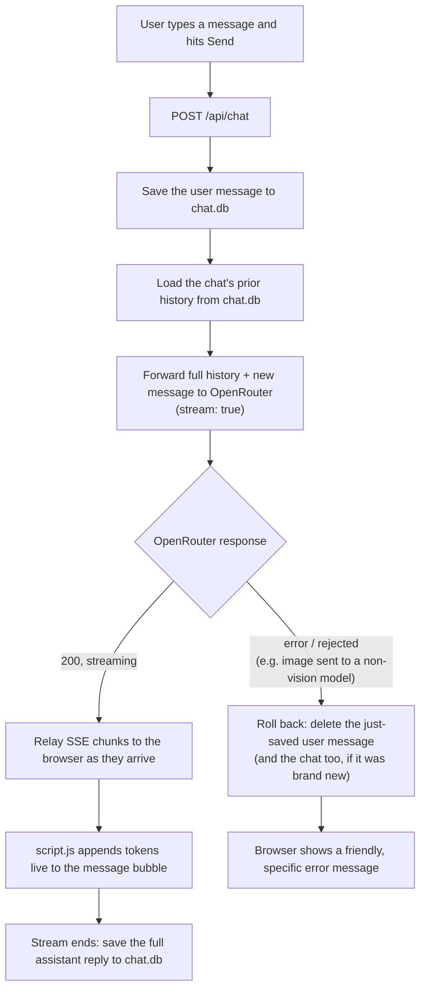

# chat-platform: a local LLM ChAT 🐱

[](https://github.com/mlliarm/chat-platform/actions/workflows/ci.yml)

A minimal local chat app (Flask backend + vanilla JS frontend) that sends prompts
to any model available on [OpenRouter](https://openrouter.ai) and streams the
response back in a ChatGPT/Claude-style UI.

> Built to run on your own machine. It has no authentication and no rate
> limiting, and the OpenRouter API key lives server-side — so anyone who can
> reach the port can spend your credits. See [Security](#security) before
> exposing it to anything wider than localhost.

## Setup

```bash
python -m venv venv
source venv/bin/activate
pip install -r requirements.txt

cp .env.example .env
# edit .env and set OPENROUTER_API_KEY to your key (https://openrouter.ai/keys)
```

## Run

```bash
python app.py
```

Then open http://localhost:5000

Optional environment variables, all with safe defaults:

| Variable | Default | Purpose |
| --- | --- | --- |
| `DEFAULT_MODEL` | `openai/gpt-4o-mini` | Model preselected in the picker; any OpenRouter model id works. |
| `HOST` / `PORT` | `127.0.0.1` / `5000` | Bind address. Only widen `HOST` behind something that authenticates. |
| `FLASK_DEBUG` | off | Auto-reload plus the Werkzeug debugger. Local development only — see [Security](#security). |
| `APP_URL` / `APP_NAME` | localhost / app name | Sent to OpenRouter as attribution headers; cosmetic. |

## Running tests

### Backend (pytest)

```bash
pip install -r requirements-dev.txt
pytest
```

Tests never touch the real `chat.db` — `db.DB_PATH` is redirected to an
isolated temp file per test (see `tests/conftest.py`), and all OpenRouter
network calls are mocked, so no API key or network access is needed to run
the suite.

### Frontend (Vitest + Playwright)

```bash
npm install
npx playwright install chromium  # first time only, needed by the e2e tier

npm test              # runs both tiers below
npm run test:unit     # Vitest + jsdom unit tests
npm run test:unit:watch
npm run test:e2e      # Playwright e2e tests
```

The unit tier (`tests/frontend/unit/`) loads the real `static/script.js`
into a fresh jsdom realm per test — no refactor of the script needed, since
its top-level `function` declarations attach to `window` when evaluated. It
covers time formatting, error-message rewriting, image/attachment parsing,
markdown rendering, the full SSE streaming send flow (including rollback
and chat-deleted edge cases), the model picker, chat list/CRUD, composer
UI, and export-button state.

The e2e tier (`tests/frontend/e2e/`) drives a real Chromium browser against
a real Flask server, started automatically via `venv/bin/flask` on a
dedicated port (5799) with an isolated temp SQLite DB — the real `chat.db`
is never touched. It covers page load, streaming send, image/file
attachments, chat management (create, switch, pin, delete), model
filtering, error banners, PDF export, and light/dark theming. `/api/chat`
and `/api/models` are mocked at the network layer since they depend on
OpenRouter; `/api/extract` hits the real Flask route. This tier requires
the Python venv from [Setup](#setup) to exist with dependencies installed.

## Type checking

`app.py`, `db.py`, and the test suite are fully type-annotated.

```bash
pip install -r requirements-dev.txt
mypy
```

## How it works

The app is a thin Flask backend that proxies chat completions to OpenRouter
and streams them to a vanilla-JS frontend over Server-Sent Events (SSE),
with SQLite for persistence.

### Architecture


### Sending a message



### Files

| File | Responsibility |
| --- | --- |
| `app.py` | Flask routes: streamed chat completions (`/api/chat`), model catalog (`/api/models`), file/PDF text extraction (`/api/extract`), chat list/get/delete/pin (`/api/chats...`), PDF export (`/api/chats/<id>/export`). |
| `db.py` | SQLite persistence layer (`chat.db`, created automatically) — `chats` and `messages` tables, auto-migrated schema, chat titles derived from the first message. |
| `markdown_pdf.py` | Renders an assistant reply's Markdown into `reportlab` PDF content: headings, lists, tables, blockquotes, and Pygments-syntax-highlighted code blocks. Uses bundled DejaVu Sans/Mono fonts (`fonts/`) instead of the PDF standard fonts, since those only cover Latin-1 and would show Greek, Cyrillic, APL symbols, etc. as blank boxes. Strips any `<think>...</think>` reasoning-model artifact (including a stray, unmatched closing tag) before rendering. |
| `static/script.js` | Reads the SSE stream chunk by chunk and renders tokens live; renders Markdown via `marked` with a `highlight.js` code-block renderer so code is syntax-highlighted the same way as in exported PDFs; claims LaTeX spans as their own `marked` token and typesets them with MathJax; manages the sidebar's chat list and attachment state. |
| `templates/index.html` + `static/style.css` | Sidebar with past chats (click to reopen, ✕ to delete, ⭐ to pin), model selector, "New chat", centered message list and composer — styled after Claude/ChatGPT, with a light/dark theme. |

## Notes

- Assistant replies render LaTeX with MathJax. Inline math is written as
  `$…$` or `\(…\)`, display math as `$$…$$` or `\[…\]`. Math inside code
  spans and fenced code blocks is left as literal source, and bare currency
  amounts (`$5`) are not mistaken for math.
- Swap `DEFAULT_MODEL` in `.env` to any OpenRouter model id (e.g.
  `anthropic/claude-sonnet-4.5`, `openai/gpt-4o`, `google/gemini-2.0-flash-001`).

## Security

This is a single-user local tool, not a deployable service. Before putting it
anywhere other people can reach, you would need to add authentication and rate
limiting — neither exists here.

What the code does do:

- **The API key never reaches the browser.** Upstream errors are scrubbed of
  key-shaped strings before being relayed to the client, and a 402 is replaced
  with a generic credits message rather than passed through.
- **`.env` and `chat.db` are gitignored** and have never been committed.
- **Assistant Markdown is sanitized** with DOMPurify before it is inserted as
  HTML, and all CDN assets are pinned with Subresource Integrity hashes so a
  tampered file — DOMPurify itself included — is refused by the browser.
- **SQL is fully parameterized**, and uploads are capped at 15 MB with
  extracted attachment text truncated at 30k characters.
- **The debugger is off by default.** `FLASK_DEBUG=1` enables an interactive
  Python console on any traceback; never set it on a host anything else can
  reach. The server binds to `127.0.0.1` by default for the same reason.

## License

[AGPL-3.0](LICENSE). You are free to use, modify, and distribute this, but
derivative works must also be released under the AGPL-3.0 — and because this
is the *Affero* variant, that obligation extends to network use: if you run a
modified version as a service others can interact with over a network, you
must offer those users the source of your modified version (section 13). Plain
GPL-3.0 would only require this when you distribute the software itself.
